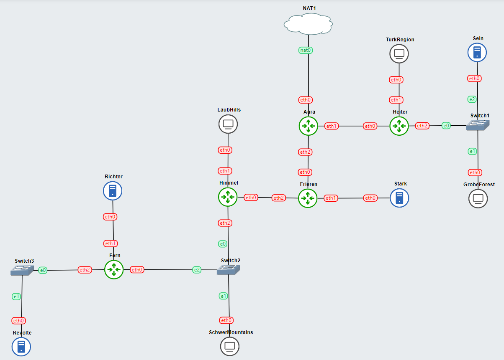

# Laporan Resmi Praktikum Jaringan Komputer - Modul 5 IT 20

> Annisa Rahmapuri - 5027211018
> 

> Abdul Zaki Syahrul Rahmat - 502721120
> 

## Persiapan Topologi



### Rute

Hasil rute berdasarkan topologi dan kelompok subnet yang telah kami buat : 


### Tree

Hasil tree berdasarkan perhitungan pembagian subnet yang telah kami buat : 


### Pembagian IP

Hasil pembagian IP berdasarkan tree yang telah kami buat : 


## Konfigurasi & Routing

Berdasarkan subnetting yang telah kami buat, berikut merupakan konfigurasi dan routing untuk setiap node yang ada dalam topologi : 

- Aura
    
    ```bash
    auto eth0
    iface eth0 inet dhcp
    
    auto eth1
    iface eth1 inet static
    	address 192.243.14.129
    	netmask 255.255.255.252
    
    auto eth2
    iface eth2 inet static
    	address 192.243.14.133
    	netmask 255.255.255.252
    ```
    
    ```bash
    # A2
    route add -net 192.243.0.0 netmask 255.255.248.0 gw 192.243.14.130
    # A3
    route add -net 192.243.8.0 netmask 255.255.252.0 gw 192.243.14.130
    
    # A5
    route add -net 192.243.14.136 netmask 255.255.255.252 gw 192.243.14.134
    # A6
    route add -net 192.243.14.140 netmask 255.255.255.252 gw 192.243.14.134
    # A7
    route add -net 192.243.12.0 netmask 255.255.254.0 gw 192.243.14.134
    # A8
    route add -net 192.243.14.0 netmask 255.255.255.128 gw 192.243.14.134
    # A9
    route add -net 192.243.14.144 netmask 255.255.255.252 gw 192.243.14.134
    # A10
    route add -net 192.243.14.148 netmask 255.255.255.252 gw 192.243.14.134
    ```
    
- Heiter
    
    ```bash
    auto eth0
    iface eth0 inet static
    	address 192.243.14.130
    	netmask 255.255.255.252
      gateway 192.243.14.129
    
    auto eth1
    iface eth1 inet static
    	address 192.243.0.1
    	netmask 255.255.248.0
    
    auto eth2
    iface eth2 inet static
    	address 192.243.8.1
    	netmask 255.255.252.0
    ```
    
    ```bash
    # To Aura
    route add -net 0.0.0.0 netmask 0.0.0.0 gw 192.243.14.129
    ```
    
    **DHCP Relay →** DHCP Relay diberikan pada router yang berdekatan dengan client, yaitu pada `Heiter` dan `Himmel`
    
    ```bash
    echo 'nameserver 192.168.122.1' > /etc/resolv.conf
    
    apt update
    apt install netcat -y
    apt install isc-dhcp-relay -y
    
    echo '
    SERVERS="192.243.14.150"
    INTERFACES="eth0 eth1 eth2 eth3"
    OPTIONS=""
    ' > /etc/default/isc-dhcp-relay
    
    echo 'net.ipv4.ip_forward=1' > /etc/sysctl.conf
    
    service isc-dhcp-relay restart
    ```
    
- Frieren
    
    ```bash
    auto eth0
    iface eth0 inet static
    	address 192.243.14.134
    	netmask 255.255.255.252
      gateway 192.243.14.133
    
    auto eth1
    iface eth1 inet static
    	address 192.243.14.137
    	netmask 255.255.255.252
    
    auto eth2
    iface eth2 inet static
    	address 192.243.14.141
    	netmask 255.255.255.252
    ```
    
    ```bash
    # To Aura
    route add -net 0.0.0.0 netmask 0.0.0.0 gw 192.243.14.133
    
    # A7
    route add -net 192.243.12.0 netmask 255.255.254.0 gw 192.243.14.142
    # A8
    route add -net 192.243.14.0 netmask 255.255.255.128 gw 192.243.14.142
    # A9
    route add -net 192.243.14.144 netmask 255.255.255.252 gw 192.243.14.142
    # A10
    route add -net 192.243.14.148 netmask 255.255.255.252 gw 192.243.14.142
    ```
    
- Himmel
    
    ```bash
    auto eth0
    iface eth0 inet static
    	address 192.243.14.142
    	netmask 255.255.255.252
      gateway 192.243.14.141
    
    auto eth1
    iface eth1 inet static
    	address 192.243.12.1
    	netmask 255.255.254.0
    
    auto eth2
    iface eth2 inet static
    	address 192.243.14.1
    	netmask 255.255.255.128
    ```
    
    ```bash
    # To Frieren
    route add -net 0.0.0.0 netmask 0.0.0.0 gw 192.243.14.141
    
    # A9
    route add -net 192.243.14.144 netmask 255.255.255.252 gw 192.243.14.2
    # A10
    route add -net 192.243.14.148 netmask 255.255.255.252 gw 192.243.14.2
    ```
    
    **DHCP Relay →** DHCP Relay diberikan pada router yang berdekatan dengan client, yaitu pada `Heiter` dan `Himmel`
    
    ```bash
    echo 'nameserver 192.168.122.1' > /etc/resolv.conf
    
    apt update
    apt install netcat -y
    apt install isc-dhcp-relay -y
    
    echo '
    SERVERS="192.243.14.150"
    INTERFACES="eth0 eth1 eth2 eth3"
    OPTIONS=""
    ' > /etc/default/isc-dhcp-relay
    
    echo 'net.ipv4.ip_forward=1' > /etc/sysctl.conf
    
    service isc-dhcp-relay restart
    ```
    
- Fern
    
    ```bash
    auto eth0
    iface eth0 inet static
    	address 192.243.14.2
    	netmask 255.255.255.128
      gateway 192.243.14.1
    
    auto eth1
    iface eth1 inet static
    	address 192.243.14.145
    	netmask 255.255.255.252
    
    auto eth2
    iface eth2 inet static
    	address 192.243.14.149
    	netmask 255.255.255.252
    ```
    
    ```bash
    # To Himmel
    route add -net 0.0.0.0 netmask 0.0.0.0 gw 192.243.14.1
    ```
    
- Revolte
    
    ```bash
    auto eth0
    iface eth0 inet static
    	address 192.243.14.150
    	netmask 255.255.255.252
      gateway 192.243.14.149
    ```
    
    Revolte juga berperan menjadi `DHCP Server`, dengan tambahan konfigurasi sebagai berikut : 
    
    ```bash
    echo '
    # A3
    subnet 192.243.8.0 netmask 255.255.252.0 {
      range 192.243.8.2 192.243.11.254;
      option routers 192.243.8.1;
      option broadcast-address 192.243.11.255; 
      option domain-name-servers 192.243.14.146;
      default-lease-time 720;
      max-lease-time 7200;
    }
    
    # A2
    subnet 192.243.0.0 netmask 255.255.248.0 {
      range 192.243.0.2 192.243.7.254;
      option routers 192.243.0.1;
      option broadcast-address 192.243.7.255;
      option domain-name-servers 192.243.14.146;
      default-lease-time 720;
      max-lease-time 7200;
    }
    
    # A7
    subnet 192.243.12.0 netmask 255.255.254.0 {
      range 192.243.12.2 192.243.13.254;
      option routers 192.243.12.1;
      option broadcast-address 192.243.13.255;
      option domain-name-servers 192.243.14.146;
      default-lease-time 720;
      max-lease-time 7200;
    }
    
    # A8
    subnet 192.243.14.0 netmask 255.255.255.128 {
      range 192.243.14.2 192.243.14.126;
      option routers 192.243.14.1;
      option broadcast-address 192.243.14.127;
      option domain-name-servers 192.243.14.146;
      default-lease-time 720;
      max-lease-time 7200;
    }
    
    # A1
    subnet 192.243.14.128 netmask 255.255.255.252 {}
    
    # A4
    subnet 192.243.14.132 netmask 255.255.255.252 {}
    
    # A5
    subnet 192.243.14.136 netmask 255.255.255.252 {}
    
    # A6
    subnet 192.243.14.140 netmask 255.255.255.252 {}
    
    # A9
    subnet 192.243.14.144 netmask 255.255.255.252 {}
    
    # A10
    subnet 192.243.14.148 netmask 255.255.255.252 {}
    ' > /etc/dhcp/dhcpd.conf
    
    service isc-dhcp-server start
    ```
    
- Ritcher
    
    ```bash
    auto eth0
    iface eth0 inet static
    	address 192.243.14.146
    	netmask 255.255.255.252
      gateway 192.243.14.145
    ```
    
    Ritcher juga berperan menjadi `DNS Server`, dengan tambahan konfigurasi sebagai berikut :
    
    ```bash
    echo 'nameserver 192.168.122.1' >/etc/resolv.conf
    
    apt get-update
    apt get-install netcat -y
    apt get-install bind9 -y
    
    echo '
    options {
      directory "/var/cache/bind";
      forwarders { 192.168.122.1; };
      allow-query { any; };
      auth-nxdomain no; // conform to RFC1035
      listen-on-v6 { any; };
    };' > /etc/bind/named.conf.options
    ```
    
- Stark
    
    ```bash
    auto eth0
    iface eth0 inet static
    	address 192.243.14.138
    	netmask 255.255.255.252
      gateway 192.243.14.137
    ```
    
    Stark juga berperan menjadi `Web Server`, dengan tambahan konfigurasi sebagai berikut : 
    
    ```bash
    echo 'nameserver 192.168.122.1' > /etc/resolv.conf
    
    apt update
    apt install netcat -y
    apt install apache2 -y
    service apache2 start
    
    echo '# If you just change the port or add more ports here, you will likely also
    # have to change the VirtualHost statement in
    # /etc/apache2/sites-enabled/000-default.conf
    
    Listen 80
    Listen 443
    
    <IfModule ssl_module>
            Listen 443
    </IfModule>
    
    <IfModule mod_gnutls.c>
            Listen 443
    </IfModule>
    
    # vim: syntax=apache ts=4 sw=4 sts=4 sr noet' > /etc/apache2/ports.conf
    ```
    
    Lalu pada `/var/www/html/index.html` ditambahkan berikut : 
    
    ```bash
    echo 'Selamat datang di Web Server - Stark!' > /var/www/html/index.html
    ```
    
- Sein
    
    ```bash
    auto eth0
    iface eth0 inet static
    	address 192.243.8.2
    	netmask 255.255.252.0
      gateway 192.243.8.1
    ```
    
    Sein juga berperan menjadi `Web Server`, dengan tambahan konfigurasi sebagai berikut : 
    
    ```bash
    echo 'nameserver 192.168.122.1' > /etc/resolv.conf
    
    apt update
    apt install netcat -y
    apt install apache2 -y
    service apache2 start
    
    echo '# If you just change the port or add more ports here, you will likely also
    # have to change the VirtualHost statement in
    # /etc/apache2/sites-enabled/000-default.conf
    
    Listen 80
    Listen 443
    
    <IfModule ssl_module>
            Listen 443
    </IfModule>
    
    <IfModule mod_gnutls.c>
            Listen 443
    </IfModule>
    
    # vim: syntax=apache ts=4 sw=4 sts=4 sr noet' > /etc/apache2/ports.conf
    ```
    
    Lalu pada `/var/www/html/index.html` ditambahkan berikut : 
    
    ```bash
    echo 'Selamat datang di Web Server - Sein!' > /var/www/html/index.html
    ```
    
- Client
    
    ```bash
    auto eth0
    iface eth0 inet dhcp
    ```
    

## Soal 1

Kami diminta untuk mengkonfigurasi Aura menggunakan iptables, tetapi tidak ingin menggunakan MASQUERADE untuk dapat mengakses keluar. 

### Cara Pengerjaan

Melakukan konfigurasi menggunakan `SNAT --to-source` yang mengarah pada NID dari router yang berhubungan dengan NAT. Berikut konfigurasinya : 

```bash
ETH0_IP=$(ip -4 addr show eth0 | grep -oP '(?<=inet\s)\d+(\.\d+){3}')
iptables -t nat -A POSTROUTING -o eth0 -j SNAT --to-source $ETH0_IP
```

Penjelasan : 

- Menyimpan alamat IP **`eth0`** dalam variabel **`ETH0_IP`**.
- Mengonfigurasi SNAT pada tabel NAT untuk mengganti alamat sumber paket keluar dengan alamat IP **`eth0`**.

### Testing


## Soal 2

Kami diminta untuk melakukan drop semua TCP dan UDP kecuali port 8080 pada TCP.

### Cara Pengerjaan

- Revolte
    
    Menambahkan konfigurasi untuk filtering pada TCP dan UDP dan diizinkannya port 8080.
    
    ```bash
    iptables -A INPUT -p tcp --dport 8080 -j ACCEPT
    iptables -A INPUT -p tcp -j DROP
    iptables -A INPUT -p udp -j DROP
    ```
    
    Penjelasan : 
    
    - Menambahkan aturan ke dalam chain INPUT.
    - Menggunakan protokol TCP (**`p tcp`**).
    - Menentukan port tujuan 8080 (**`-dport 8080`**).
    - Jika paket memenuhi kriteria aturan ini, maka akan diterima (**`j ACCEPT`**).
    - Jika paket tidak menggunakan protokol TCP, maka aturan ini menetapkan tindakan yang diambil, yaitu menolak (DROP) paket (**`-j DROP`**).
    - Jika paket  menggunakan protokol TCP, maka aturan ini menetapkan tindakan yang diambil, yaitu menolak (DROP) paket (**`-j DROP`**).

### Testing

- Sukses → Port 8080 pada TCP
    - Client
        
        
        
    - Revolte
        
        
        
- Gagal → Port 8080 pada UDP
    - Client

        
    - Revolte

        
- Gagal → Port lain (5000 dengan TCP)
    - Client
        
        
        
    - Revolte
        
        
        

## Soal 3

Kami diminta untuk membatasi DHCP dan DNS Server hanya dapat dilakukan ping oleh maksimal 3 device secara bersamaan, selebihnya akan di drop.

### Cara Pengerjaan

- Revolte
    
    ```bash
    **iptables -I INPUT -p icmp -m connlimit --connlimit-above 3 --connlimit-mask 0 -j DROP
    iptables -I INPUT -m state --state ESTABLISHED,RELATED -j ACCEPT**
    ```
    
    Penjelasan : 
    
    - **`I INPUT`**: Menyisipkan aturan baru ke dalam chain INPUT (rantai untuk lalu lintas yang menuju ke sistem).
    - **`p icmp`**: Menentukan protokol yang digunakan, dalam hal ini ICMP (ping).
    - **`m connlimit --connlimit-above 3 --connlimit-mask 0`**: Menggunakan modul connlimit untuk membatasi jumlah koneksi. Aturan ini menolak paket ICMP jika jumlah koneksi dari satu sumber melebihi 3.
    - **`j DROP`**: Menetapkan tindakan yang diambil jika paket memenuhi kriteria aturan, dalam hal ini menolak (DROP) paket.
    - **`m state --state ESTABLISHED,RELATED`** : Menggunakan modul state untuk menangani koneksi yang telah dibuat (**`ESTABLISHED`**) atau berkaitan (**`RELATED`**). Aturan ini memperbolehkan paket yang terkait dengan koneksi yang sudah ada.
    - **`j ACCEPT`** : Menetapkan tindakan yang diambil jika paket memenuhi kriteria aturan, dalam hal ini menerima (ACCEPT) paket.

### Testing

Mencoba ping pada 3 client → LaubHills, TurkRegion, SchewerMountains

- Berhasil
    
    
    
    
    
    
    
- Gagal (Client ke-4)
    
    
    

## Soal 4

Kami diminta untuk melakukan pembatasan sehingga koneksi SSH pada Web Server hanya dapat dilakukan oleh masyarakat yang berada pada GrobeForest.

### Cara Pengerjaan

- Sein & Stark
    
    ```bash
    iptables -A INPUT -p tcp --dport 22 -m iprange --src-range 192.243.8.2-192.243.8.255 -j ACCEPT
    iptables -A INPUT -p tcp --dport 22 -m iprange --src-range 192.243.9.0-192.243.9.255 -j ACCEPT
    iptables -A INPUT -p tcp --dport 22 -m iprange --src-range 192.243.10.0-192.243.10.255 -j ACCEPT
    iptables -A INPUT -p tcp --dport 22 -m iprange --src-range 192.243.11.0-192.243.11.254 -j ACCEPT
    
    iptables -A INPUT -p tcp --dport 22 -j DROP
    ```
    
    Penjelasan : 
    
    - Menggunakan modul iprange untuk memeriksa apakah alamat sumber berada dalam rentang 192.243.8.2 hingga 192.243.8.255 (**`m iprange --src-range 192.243.8.2-192.243.8.255`**).
    - Jika paket memenuhi kriteria aturan, maka akan diterima (**`j ACCEPT`**).
    - Jika paket tidak memenuhi aturan-aturan sebelumnya, maka aturan ini akan menetapkan tindakan yang diambil, yaitu menolak (DROP) paket (**`-j DROP`**).

### Testing

- Berhasil
    
    
    
    
    
- Gagal → Selain GrobeForest
    
    
    
    
    

## Soal 5

Kami diminta untuk megubah akses menuju WebServer hanya diperbolehkan saat jam kerja yaitu Senin-Jumat pada pukul 08.00-16.00.

### Cara Pengerjaan

- Sein & Stark
    
    ```bash
    iptables -A INPUT -m time --timestart 08:00 --timestop 16:00 --weekdays Mon,Tue,Wed,Thu,Fri -j ACCEPT
    iptables -A INPUT -j REJECT
    ```
    
    Penjelasan : 
    
    - Menambahkan aturan ke dalam chain INPUT.
    - Menggunakan modul time untuk membatasi waktu akses (**`m time`**).
    - **`-timestart 08:00`**: Menentukan waktu mulai, dalam hal ini pukul 08:00.
    - **`-timestop 16:00`**: Menentukan waktu berakhir, dalam hal ini pukul 16:00.
    - **`-weekdays Mon,Tue,Wed,Thu,Fri`**: Menentukan hari-hari dimana aturan ini berlaku, yaitu Senin hingga Jumat.
    - Jika paket memenuhi kriteria aturan ini pada waktu dan hari yang ditentukan, maka akan diterima (**`j ACCEPT`**).
    - Jika paket tidak memenuhi aturan waktu di atas, maka aturan ini menetapkan tindakan yang diambil, yaitu menolak (REJECT) paket (**`-j REJECT`**).

### Testing

- Berhasil
    
    
    
- Gagal → Di luar hari kerja
    
    
    

## Soal 6

Kami diminta untuk menambahkan rule bahwa akses pada hari Senin - Kamis pada jam 12.00 - 13.00 dilarang (istirahat maksi cuy) dan akses di hari Jumat pada jam 11.00 - 13.00 juga dilarang (maklum, Jumatan rek).

### Cara Pengerjaan

- Sein & Stark
    
    ```bash
    iptables -A INPUT -m time --timestart 12:00 --timestop 13:00 --weekdays Mon,Tue,Wed,Thu -j REJECT
    iptables -A INPUT -m time --timestart 11:00 --timestop 13:00 --weekdays Fri -j REJECT
    ```
    
    Penjelasan : 
    
    - Menambahkan aturan ke dalam chain INPUT.
    - Menggunakan modul time untuk membatasi waktu akses (**`m time`**).
    - **`-timestart 12:00`** : Menentukan waktu mulai, dalam hal ini pukul 12:00.
    - **`-timestop 13:00`** : Menentukan waktu berakhir, dalam hal ini pukul 13:00.
    - **`-weekdays Mon,Tue,Wed,Thu`** : Menentukan hari-hari dimana aturan ini berlaku, yaitu Senin hingga Kamis.
    - **`-timestart 11:00`** : Menentukan waktu mulai, dalam hal ini pukul 11:00.
    - **`-timestop 13:00`** : Menentukan waktu berakhir, dalam hal ini pukul 13:00.
    - **`-weekdays Fri`** : Menentukan hari dimana aturan ini berlaku, yaitu Jumat.
    - Jika paket memenuhi kriteria aturan ini pada waktu dan hari yang ditentukan, maka aturan ini menetapkan tindakan yang diambil, yaitu menolak (REJECT) paket (**`j REJECT`**).
    
    ### Testing
    
    - Berhasil
        
        
        
    - Gagal
        
        
        

## Soal 7

Kami diminta agar setiap client yang mengakses Sein dengan Port 80 akan didistribusikan secara bergantian pada Sein dan Stark secara berurutan dan request dari client yang mengakses Stark dengan port 443 akan didistribusikan secara bergantian pada Sein dan Stark secara berurutan.

### Cara Pengerjaan

- Sein & Stark
    
    ```bash
    while true; do nc -l -p 80 -c 'echo "ini sein"'; done
    while true; do nc -l -p 80 -c 'echo "ini stark"'; done
    while true; do nc -l -p 443 -c 'echo "ini sein"'; done
    while true; do nc -l -p 443 -c 'echo "ini stark"'; done
    
    ```
    
- Himmel & Heiter
    
    ```bash
    iptables -A PREROUTING -t nat -p tcp --dport 80 -d 192.243.8.2 -m statistic --mode nth --every 2 --packet 0 -j DNAT --to-destination 192.243.8.2
    iptables -A PREROUTING -t nat -p tcp --dport 80 -d 192.243.8.2 -j DNAT --to-destination 192.243.14.138
    iptables -A PREROUTING -t nat -p tcp --dport 443 -d 192.243.14.138 -m statistic --mode nth --every 2 --packet 0 -j DNAT --to-destination 192.243.14.138
    iptables -A PREROUTING -t nat -p tcp --dport 443 -d 192.243.14.138 -j DNAT --to-destination 192.243.8.2
    ```
    

### Testing

butuh ss jekk

## Soal 8

Kami diminta untuk membuat Revolte dilarang keras mengakses WebServer hingga masa pencoblosan pemilu kepala suku 2024 berakhir. Masa pemilu (hingga pemungutan dan penghitungan suara selesai) kepala suku bersamaan dengan masa pemilu Presiden dan Wakil Presiden Indonesia 2024

### Cara Pengerjaan

- Sein & Stark
    
    ```bash
    iptables -A INPUT -s 192.243.14.148/30 -m time --datestart 2023-12-10 --datestop 2024-02-15 -j DROP
    ```
    
    Penjelasan : 
    
    - **`A INPUT`**: Menambahkan aturan ke dalam chain INPUT (rantai untuk lalu lintas yang menuju ke sistem).
    - **`s 192.243.14.148/30`**: Menentukan alamat sumber, dalam hal ini rentang alamat IP 192.243.14.148/30 (mengandung empat alamat IP dalam subnet).
    - **`m time --datestart 2023-12-10 --datestop 2024-02-15`**: Menggunakan modul time untuk membatasi waktu akses. Menentukan tanggal mulai (**`-datestart`**) pada 10 Desember 2023 dan tanggal berakhir (**`-datestop`**) pada 15 Februari 2024.
    - **`j DROP`**: Menetapkan tindakan yang diambil jika paket memenuhi kriteria aturan, dalam hal ini menolak (DROP) paket.

### Testing


- Gagal → DHCP Server
    
    
    
- Berhasil
    
    ??? 
    

## Soal 9

Kami diminta untuk membuat WebServer harus dapat secara otomatis memblokir alamat IP yang melakukan scanning port dalam jumlah banyak (maksimal 20 scan port) di dalam selang waktu 10 menit. (clue: test dengan nmap)

### Cara Pengerjaan

- Sein & Stark
    
    ```bash
    iptables -N portscan
    ```
    
    Penjelasan : 
    
    - Membuat chain (rantai) baru dengan nama "portscan".
    
    ```bash
    iptables -A INPUT -m recent --name portscan --update --seconds 600 --hitcount 20 -j DROP
    ```
    
    Penjelasan : 
    
    - Menambahkan aturan ke chain INPUT.
    - Menggunakan modul "recent" untuk mendeteksi serangan port scanning.
    - **`-name portscan`**: Menentukan nama yang akan digunakan untuk melacak status koneksi (dalam hal ini, "portscan").
    - **`-update`**: Memperbarui waktu akses terakhir ketika paket yang sesuai diterima.
    - **`-seconds 600`**: Menentukan interval waktu (600 detik atau 10 menit) dalam interval waktu untuk melacak paket.
    - **`-hitcount 20`**: Menentukan jumlah paket yang diizinkan dalam interval waktu sebelum aturan selanjutnya diterapkan.
    - **`j DROP`**: Menetapkan tindakan yang diambil jika paket memenuhi kriteria aturan, dalam hal ini menolak (DROP) paket.
    
    ```bash
    iptables -A FORWARD -m recent --name portscan --update --seconds 600 --hitcount 20 -j DROP
    ```
    
    Penjelasan : 
    
    - Menambahkan aturan ke chain FORWARD.
    - Menggunakan modul "recent" untuk mendeteksi serangan port scanning dengan parameter yang sama seperti pada aturan sebelumnya.
    
    ```bash
    iptables -A INPUT -m recent --name portscan --set -j ACCEPT
    iptables -A FORWARD -m recent --name portscan --set -j ACCEPT
    ```
    
    Penjelasan : 
    
    - Menambahkan aturan ke chain INPUT.
    - Menggunakan modul "recent" untuk melacak status koneksi.
    - **`-set`**: Menandai paket sebagai paket yang memulai serangan (dalam hal ini, menandai paket pertama dari serangan port scanning).
    - **`j ACCEPT`**: Menetapkan tindakan yang diambil jika paket memenuhi kriteria aturan, dalam hal ini menerima (ACCEPT) paket.
    - Menambahkan aturan ke chain FORWARD.
    - Menggunakan modul "recent" untuk melacak status koneksi dengan parameter yang sama seperti pada aturan sebelumnya.

### Testing


Paket setelah 20, akan otomatis ter`DROP` dan tidak terikirim.

## Soal 10

Kami diminta untuk menambahkan logging paket yang di-drop dengan standard syslog level.
